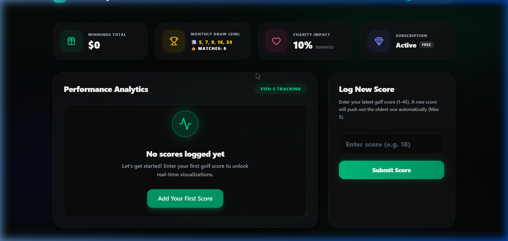
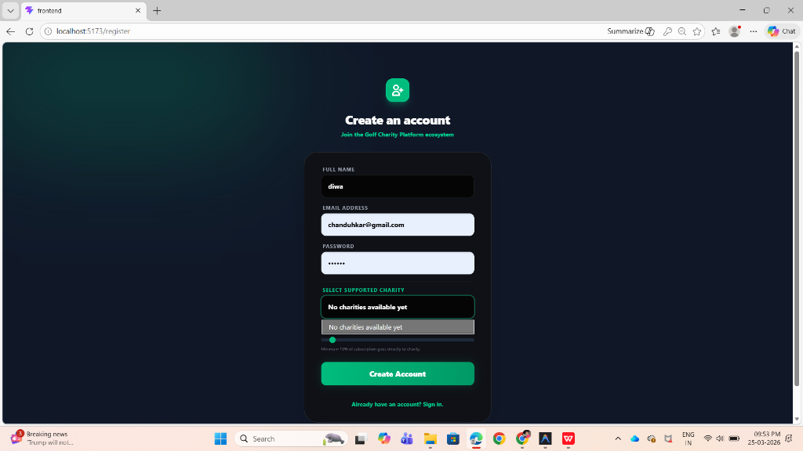

# ⛳ Golf Charity Subscription Platform

A production-ready full-stack MERN application built for the Digital Heroes Selection Process.  
This platform combines **golf performance tracking, subscription-based rewards, and charity contributions** into a single engaging experience.

---

## 🚀 Live Demo

🌐 Frontend: https://golf-charity-subscription-platform-mu.vercel.app 
⚙️ Backend API:https://golf-charity-subscription-platform-vayx.onrender.com/api

---

## 📸 Screenshots



 

---

## 🛠️ Tech Stack

- **Frontend:** React (Vite) + Tailwind CSS + Framer Motion  
- **Backend:** Node.js + Express.js  
- **Database:** MongoDB Atlas  
- **Authentication:** JWT  
- **Deployment:** Vercel (Frontend) + Render (Backend)

---

## ✨ Key Features

### 🔐 Authentication & Security
- Secure user authentication using JWT
- Role-based access (User / Admin)
- Protected routes

### 💳 Subscription System
- Monthly and yearly plans
- Subscription-based feature access control
- SaaS-style restriction for non-premium users

### ⛳ Score Management
- Users can enter golf scores (1–45)
- Maintains only the latest **5 scores (FIFO logic)**
- Automatic removal of oldest scores

### 🎲 Draw & Reward System
- Monthly draw with 5-number generation
- Match-based reward tiers:
  - 5 matches → 40% (Jackpot with rollover)
  - 4 matches → 35%
  - 3 matches → 25%
- Dynamic UI updates for winnings

### ❤️ Charity Integration
- Mandatory charity selection at signup
- Minimum 10% contribution from subscription
- Donation tracking system

### 📊 Dashboard
- Subscription status overview
- Score tracking and analytics
- Winnings summary
- Charity contributions

### 👨‍💼 Admin Panel
- Manage users and subscriptions
- Run and publish draws
- Manage charities
- Verify winners and payouts

---

## 🎨 UI/UX Highlights

- Modern **SaaS-style interface**
- Dark glassmorphism design
- Smooth animations using Framer Motion
- Fully responsive (mobile-first)

---

## ⚙️ Setup Instructions

### 🔹 Backend

```bash
cd backend
npm install
npm start
```

### 🔹 Frontend

```bash
cd frontend
npm install
npm run dev
```
##Author##
DiwakarNallappagari
